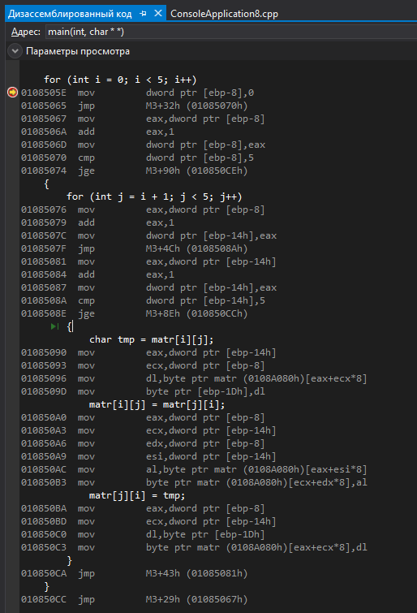

# Транспонирование части матрицы матрицы (C + asm)
### Задание
Дана матрица 
```c
int matr[8][8] = {
	{1,1,1,1,1},
	{2,2,2,2,2},
	{3,3,3,3,3},
	{4,4,4,4,4},
	{5,5,5,5,5}
};
```
Транспонировать только ее первые пять строк/столбцов.
Ассемблерный код должен быть в Си файле. 

### 2 часть задания
Посчитать **количество обращений к памяти**, если код писать на Си (смотреть в дизассемблированном коде). 
Должно получиться **около 200+**. Сравнить с количеством обращений на ассемблере. 

(Каждая пара квадратных скобок считается за обращение к памяти)  
В первый цикл мы зайдем 5 раз. Во второй 10.  


